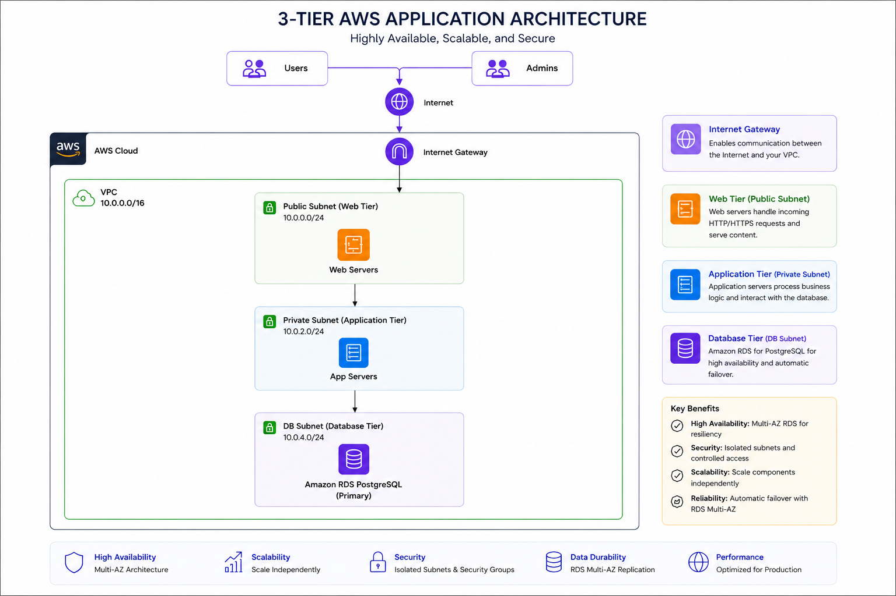
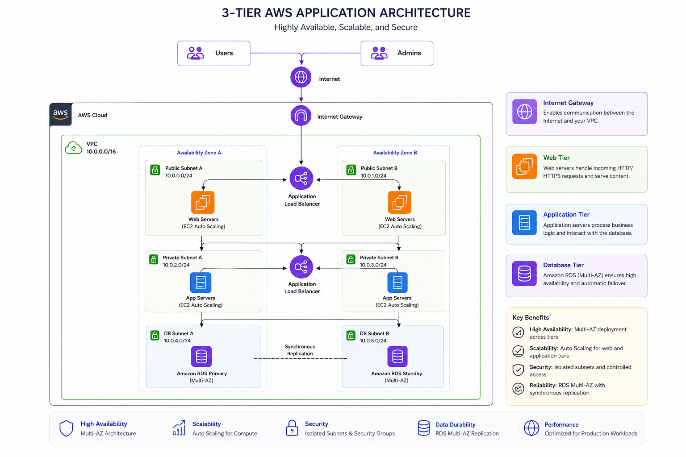

# 🏗️ Build a Production-Grade 3-Tier AWS Architecture with Terraform — Hands-On, From Scratch



> A practical, end-to-end workshop for building a real-world, production-ready 3-tier AWS architecture using Terraform — covering networking, compute, database, security, and infrastructure best practices.

---

## 📋 Table of Contents

- [About This Workshop](#-about-this-workshop)
- [Architecture Overview](#-architecture-overview)
- [Prerequisites](#-prerequisites)
- [Tech Stack](#-tech-stack)
- [Project Folder Structure](#-project-folder-structure)
- [Step 1 — Creating the S3 Backend Bucket](#-step-1--creating-the-s3-backend-bucket)
- [Step 2 — Creating Custom Modules](#-step-2--creating-custom-modules)
- [Step 3 — Creating the Dev Environment](#-step-3--creating-the-dev-environment)
- [Best Practices](#-best-practices)
- [Key Takeaways](#-key-takeaways)
- [Future Improvements](#-future-improvements)
- [Get in Touch](#-get-in-touch)
- [References and Resources](#-references-and-resources)

---

## 📖 About This Workshop

This hands-on workshop walks you through building a **production-grade, 3-tier AWS architecture** entirely with Terraform — from a blank directory to a fully functional, secured, and environment-aware cloud infrastructure.

You will learn how to:

- Structure Terraform projects for real-world maintainability
- Build and reuse **custom Terraform modules** for VPC and EC2
- Leverage **community modules** from the Terraform Registry for security groups and RDS
- Configure **remote state** with S3 backend and state locking
- Apply **least-privilege security** between tiers using security groups
- Manage **multiple environments** (dev, staging, prod) from a single codebase

This is not a click-through tutorial — you will write, reason about, and debug real Terraform code.

---

## 🏛️ Architecture Overview

The architecture follows a classic 3-tier model:

| Tier | AWS Service | Description |
|---|---|---|
| **Presentation (Web)** | EC2 (Public Subnet) | Public-facing instances, accessible from the internet |
| **Application (App)** | EC2 (Private Subnet) | Business logic layer, no direct internet exposure |
| **Data** | RDS PostgreSQL (Private Subnet) | Managed database, accessible only from the app tier |

**Networking highlights:**
- A custom VPC spanning **2 Availability Zones** for resilience
- Public subnets with an Internet Gateway for the web tier
- Private subnets with a NAT Gateway for outbound-only access from the app/data tiers
- Security groups enforcing strict, tier-to-tier traffic rules

---

## ✅ Prerequisites

Before starting this workshop, ensure you have the following:

- An **AWS account** with IAM permissions to create VPCs, EC2 instances, RDS instances, S3 buckets, and security groups
- **Terraform** v1.5+ installed — [Install Terraform](https://developer.hashicorp.com/terraform/install)
- **AWS CLI** v2 installed and configured — [Install AWS CLI](https://docs.aws.amazon.com/cli/latest/userguide/install-cliv2.html)
- **Git** installed
- Basic familiarity with Terraform HCL syntax and AWS core services

Configure your AWS credentials before running any Terraform commands:

```bash
aws configure
# or use environment variables:
export AWS_ACCESS_KEY_ID="your-access-key"
export AWS_SECRET_ACCESS_KEY="your-secret-key"
export AWS_DEFAULT_REGION="us-east-1"
```

---

## 🛠️ Tech Stack

- **Infrastructure as Code:** Terraform ~> 1.5
- **Cloud Provider:** AWS (`hashicorp/aws` ~> 5.0)
- **Compute:** Amazon EC2
- **Database:** Amazon RDS for PostgreSQL 16
- **Networking:** Amazon VPC, Subnets, Internet Gateway, NAT Gateway
- **Security:** AWS Security Groups
- **State Management:** Amazon S3 + DynamoDB (state locking)
- **Community Modules:** `terraform-aws-modules/vpc`, `terraform-aws-modules/security-group`, `terraform-aws-modules/rds`

---

## 📁 Project Folder Structure

```
terraform-3tier-workshop/
│
├── books/                          # Supplementary reading and reference material
│
├── images/                         # Architecture diagrams
│   ├── 3-tier-architecture.png
│   └── 3-tier-architecture-future-imp.png
│
├── state-bootstrap/                # One-time setup: S3 bucket + DynamoDB for remote state
│   ├── main.tf
│   ├── variables.tf
│   └── outputs.tf
│
├── modules/                        # Reusable custom Terraform modules
│   ├── vpc/                        # Custom VPC module
│   │   ├── main.tf
│   │   ├── variables.tf
│   │   └── outputs.tf
│   └── ec2/                        # Custom EC2 module
│       ├── main.tf
│       ├── variables.tf
│       └── outputs.tf
│
├── environment/
│   └── dev/                        # Dev environment root configuration
│       ├── backend.tf              # Remote state backend config
│       ├── provider.tf             # AWS provider config
│       ├── main.tf                 # Module calls and resource definitions
│       ├── variables.tf            # Input variables
│       ├── terraform.tfvars        # Variable values (do not commit secrets)
│       └── outputs.tf              # Environment outputs
│
├── .gitignore
└── Readme.md
```

> **Convention:** Each module contains exactly three files — `main.tf` (resources), `variables.tf` (inputs), and `outputs.tf` (outputs). This keeps modules predictable and easy to navigate.

---

## 🪣 Step 1 — Creating the S3 Backend Bucket

Terraform state tracks everything it manages. By default, state is stored locally — which is unsafe for teams and risky for production. We bootstrap a **remote backend** using S3 (storage) and DynamoDB (state locking) before writing any environment code.

> **Note:** The S3 bucket can be created in three ways: using the `state-bootstrap` Terraform config in this repo (recommended), via the AWS Console, or via the AWS CLI. All three approaches are shown below.

### a. Creating the S3 Bucket with Versioning, AES Encryption, and Public Access Block

#### Option 1 — Using the `state-bootstrap` Terraform config (recommended)

Navigate to the bootstrap directory and apply:

```bash
cd state-bootstrap
terraform init
terraform apply
```

The bootstrap config creates:

```hcl
# state-bootstrap/main.tf

resource "aws_s3_bucket" "terraform_state" {
  bucket        = "${var.project_name}-terraform-state"
  force_destroy = false

  tags = {
    Name        = "${var.project_name}-terraform-state"
    Environment = "global"
    ManagedBy   = "terraform"
  }
}

# Enable versioning — allows recovery of previous state files
resource "aws_s3_bucket_versioning" "terraform_state" {
  bucket = aws_s3_bucket.terraform_state.id

  versioning_configuration {
    status = "Enabled"
  }
}

# Enable AES-256 server-side encryption
resource "aws_s3_bucket_server_side_encryption_configuration" "terraform_state" {
  bucket = aws_s3_bucket.terraform_state.id

  rule {
    apply_server_side_encryption_by_default {
      sse_algorithm = "AES256"
    }
  }
}

# Block all public access — state files must never be public
resource "aws_s3_bucket_public_access_block" "terraform_state" {
  bucket = aws_s3_bucket.terraform_state.id

  block_public_acls       = true
  block_public_policy     = true
  ignore_public_acls      = true
  restrict_public_buckets = true
}

# DynamoDB table for state locking — prevents concurrent apply conflicts
resource "aws_dynamodb_table" "terraform_locks" {
  name         = "${var.project_name}-terraform-locks"
  billing_mode = "PAY_PER_REQUEST"
  hash_key     = "LockID"

  attribute {
    name = "LockID"
    type = "S"
  }

  tags = {
    Name      = "${var.project_name}-terraform-locks"
    ManagedBy = "terraform"
  }
}
```

#### Option 2 — Using the AWS CLI

```bash
BUCKET_NAME="my-project-terraform-state"
REGION="us-east-1"

# Create the bucket
aws s3api create-bucket \
  --bucket $BUCKET_NAME \
  --region $REGION

# Enable versioning
aws s3api put-bucket-versioning \
  --bucket $BUCKET_NAME \
  --versioning-configuration Status=Enabled

# Enable AES-256 encryption
aws s3api put-bucket-encryption \
  --bucket $BUCKET_NAME \
  --server-side-encryption-configuration '{
    "Rules": [{
      "ApplyServerSideEncryptionByDefault": {
        "SSEAlgorithm": "AES256"
      }
    }]
  }'

# Block all public access
aws s3api put-public-access-block \
  --bucket $BUCKET_NAME \
  --public-access-block-configuration \
    "BlockPublicAcls=true,IgnorePublicAcls=true,BlockPublicPolicy=true,RestrictPublicBuckets=true"

# Create DynamoDB table for state locking
aws dynamodb create-table \
  --table-name my-project-terraform-locks \
  --attribute-definitions AttributeName=LockID,AttributeType=S \
  --key-schema AttributeName=LockID,KeyType=HASH \
  --billing-mode PAY_PER_REQUEST \
  --region $REGION
```

#### Option 3 — Using the AWS Console

1. Navigate to **S3 → Create bucket**
2. Set a globally unique name and select your region
3. Under **Bucket Versioning**, select **Enable**
4. Under **Default encryption**, select **SSE-S3 (AES-256)**
5. Under **Block Public Access**, ensure all four options are checked
6. Create the bucket, then create a **DynamoDB table** named `<project>-terraform-locks` with `LockID` (String) as the partition key

---

## 🧩 Step 2 — Creating Custom Modules

Custom modules allow you to encapsulate, reuse, and version your infrastructure building blocks. We build two custom modules: VPC and EC2.

### Creating Custom Modules

A Terraform module is simply a directory containing `.tf` files. The three-file pattern (`main.tf`, `variables.tf`, `outputs.tf`) is the community standard.

### a. VPC Module

The VPC module provisions the entire network layer: VPC, public/private subnets across 2 AZs, Internet Gateway, NAT Gateway, and route tables.

```
modules/vpc/
├── main.tf        # VPC, subnets, IGW, NAT GW, route tables, DB subnet group
├── variables.tf   # Input: CIDR blocks, AZs, env name, tags
└── outputs.tf     # Output: vpc_id, public_subnet_ids, private_subnet_ids, azs
```

Key design decisions in the VPC module:

- **Two AZs minimum** — required by RDS and recommended for all production workloads
- **Private subnets** for EC2 app tier and RDS — no direct internet exposure
- **Single NAT Gateway** (cost-saving for dev; use one per AZ for prod)
- **DB subnet group** created within the module so RDS can be deployed immediately

```hcl
# modules/vpc/variables.tf (example)
variable "env_name"        { type = string }
variable "vpc_cidr"        { type = string }
variable "public_subnets"  { type = list(string) }
variable "private_subnets" { type = list(string) }
variable "azs"             { type = list(string) }
```

```hcl
# modules/vpc/outputs.tf (example)
output "vpc_id"              { value = aws_vpc.this.id }
output "public_subnet_ids"   { value = aws_subnet.public[*].id }
output "private_subnet_ids"  { value = aws_subnet.private[*].id }
output "availability_zones"  { value = var.azs }
output "db_subnet_group_name" { value = aws_db_subnet_group.this.name }
```

### b. EC2 Module

The EC2 module provisions compute instances with configurable AMI, instance type, subnet placement, security group associations, and user data.

```
modules/ec2/
├── main.tf        # aws_instance resource, optional EBS volumes
├── variables.tf   # Input: ami, instance_type, subnet_id, sg_ids, tags
└── outputs.tf     # Output: instance_id, private_ip, public_ip
```

Key design decisions in the EC2 module:

- Accepts `subnet_id` and `vpc_security_group_ids` as inputs — subnet placement is controlled by the calling environment, not hardcoded in the module
- Supports `user_data` for bootstrapping (e.g. installing packages on first boot)
- IMDSv2 enforced for instance metadata security

```hcl
# modules/ec2/variables.tf (example)
variable "env_name"               { type = string }
variable "ami"                    { type = string }
variable "instance_type"          { type = string  default = "t3.micro" }
variable "subnet_id"              { type = string }
variable "vpc_security_group_ids" { type = list(string) }
variable "user_data"              { type = string  default = "" }
variable "tags"                   { type = map(string) default = {} }
```

---

## 🌍 Step 3 — Creating the Dev Environment

The `environment/dev/` directory is the root Terraform configuration for the dev environment. It wires together all custom and community modules into a working, deployable stack.

```bash
cd environment/dev
terraform init
terraform plan
terraform apply
```

### a. Configuring the Backend for the Dev Environment

Remote state is configured in `backend.tf`. This file **cannot use variables** — all values must be literals.

```hcl
# environment/dev/backend.tf

terraform {
  backend "s3" {
    bucket         = "my-project-terraform-state"   # your S3 bucket name
    key            = "dev/terraform.tfstate"         # unique key per environment
    region         = "us-east-1"
    dynamodb_table = "my-project-terraform-locks"    # DynamoDB table for locking
    encrypt        = true
  }
}
```

> **Multi-environment tip:** Each environment uses a different `key` (`dev/terraform.tfstate`, `staging/terraform.tfstate`, `prod/terraform.tfstate`) but the same bucket. This keeps state files isolated while sharing a single backend.

### b. Configuring the Provider

```hcl
# environment/dev/provider.tf

terraform {
  required_version = ">= 1.5"

  required_providers {
    aws = {
      source  = "hashicorp/aws"
      version = "~> 5.0"
    }
  }
}

provider "aws" {
  region = var.aws_region

  default_tags {
    tags = {
      Environment = var.env_name
      Project     = "terraform-3tier-workshop"
      ManagedBy   = "terraform"
    }
  }
}
```

> **Pro tip:** Use `default_tags` in the provider block to tag every resource automatically without repeating tag blocks in every module call.

### c. Using Custom Modules — VPC and EC2

```hcl
# environment/dev/main.tf

# --- VPC (custom module) ---
module "dev_vpc" {
  source = "../../modules/vpc"

  env_name        = var.env_name
  vpc_cidr        = "10.0.0.0/16"
  azs             = ["us-east-1a", "us-east-1b"]
  public_subnets  = ["10.0.101.0/24", "10.0.102.0/24"]
  private_subnets = ["10.0.1.0/24", "10.0.2.0/24"]
}

# --- EC2 Private Instance (custom module) ---
module "dev_ec2_private" {
  source = "../../modules/ec2"

  env_name               = var.env_name
  ami                    = var.ec2_ami
  instance_type          = "t3.micro"
  subnet_id              = module.dev_vpc.private_subnet_ids[0]
  vpc_security_group_ids = [module.ec2_private_security_group.security_group_id]

  tags = {
    Name = "${var.env_name}-private-ec2"
    Tier = "application"
  }
}
```

### d. Using Community Modules from the Terraform Registry — Security Groups and RDS

Community modules from the [Terraform Registry](https://registry.terraform.io) let you adopt battle-tested patterns without writing everything from scratch.

```hcl
# --- Security Group for Private EC2 (community module) ---
module "ec2_private_security_group" {
  source  = "terraform-aws-modules/security-group/aws"
  version = "~> 5.0"

  name        = "${var.env_name}-ec2-private-sg"
  description = "Security group for private EC2 instances"
  vpc_id      = module.dev_vpc.vpc_id

  ingress_with_cidr_blocks = [
    {
      from_port   = 22
      to_port     = 22
      protocol    = "tcp"
      description = "SSH from VPN/bastion only"
      cidr_blocks = var.allowed_ssh_cidr
    }
  ]
  egress_rules = ["all-all"]
}

# --- Security Group for RDS (community module — PostgreSQL preset) ---
module "rds_postgresql_security_group" {
  source  = "terraform-aws-modules/security-group/aws//modules/postgresql"
  version = "~> 5.0"

  name        = "${var.env_name}-rds-postgresql-sg"
  description = "Security group for RDS PostgreSQL — allows traffic from private EC2 only"
  vpc_id      = module.dev_vpc.vpc_id

  ingress_rules       = []
  ingress_cidr_blocks = []

  # Only allow port 5432 from the private EC2 security group
  ingress_with_source_security_group_id = [
    {
      from_port                = 5432
      to_port                  = 5432
      protocol                 = "tcp"
      description              = "PostgreSQL from private EC2 only"
      source_security_group_id = module.ec2_private_security_group.security_group_id
    }
  ]
  egress_rules = ["all-all"]
}

# --- RDS PostgreSQL (community module) ---
module "dev_rds" {
  source  = "terraform-aws-modules/rds/aws"
  version = "~> 6.0"

  identifier = "${var.env_name}-postgresql"

  engine               = "postgres"
  engine_version       = "16"
  family               = "postgres16"
  major_engine_version = "16"
  instance_class       = "db.t3.micro"

  allocated_storage     = 20
  max_allocated_storage = 100
  storage_encrypted     = true

  db_name  = var.db_name
  username = var.db_username
  password = var.db_password
  port     = 5432

  # Use the output reference — not a hardcoded string — so Terraform
  # knows to create the subnet group before the RDS instance
  db_subnet_group_name   = module.dev_vpc.db_subnet_group_name
  vpc_security_group_ids = [module.rds_postgresql_security_group.security_group_id]

  availability_zone = module.dev_vpc.availability_zones[0]
  multi_az          = false

  backup_retention_period = 7
  backup_window           = "03:00-04:00"
  maintenance_window      = "Mon:04:00-Mon:05:00"

  enabled_cloudwatch_logs_exports = ["postgresql", "upgrade"]

  deletion_protection      = false   # set true for production
  skip_final_snapshot      = true    # set false for production
  delete_automated_backups = true
}
```

> **Critical:** Always pass `db_subnet_group_name` as a **resource reference** (e.g. `module.dev_vpc.db_subnet_group_name`), never as a hardcoded string. A hardcoded string removes Terraform's ability to infer the dependency, which can cause `DBSubnetGroupNotFound` errors during `apply`.

---

## 🛡️ Best Practices

The following practices are applied throughout this workshop and are recommended for any production Terraform project.

**State management**
- Always use remote state with S3 + DynamoDB locking — never commit `.tfstate` files to Git
- Use a separate state key per environment (`dev/terraform.tfstate`, `prod/terraform.tfstate`)
- Enable S3 versioning so you can roll back to a previous state file if needed

**Security**
- Follow least-privilege for security groups: allow only the specific port, protocol, and source needed
- Never use `0.0.0.0/0` for ingress unless the tier is explicitly public-facing
- Store sensitive values (DB passwords, API keys) in AWS Secrets Manager or SSM Parameter Store — not in `.tfvars` files committed to Git
- Add `.terraform/`, `*.tfstate`, `*.tfstate.backup`, and `*.tfvars` containing secrets to `.gitignore`
- Enable storage encryption for RDS (`storage_encrypted = true`)

**Module design**
- Pass resource references between modules rather than hardcoded strings — this gives Terraform the dependency graph it needs to order operations correctly
- Keep modules single-purpose and composable
- Always define `outputs.tf` — callers should never have to reach inside a module's internal resources

**Tagging**
- Use `default_tags` in the provider block to enforce consistent tags on every resource
- At minimum, tag every resource with `Environment`, `Project`, and `ManagedBy`

**Cost control (for dev/non-prod)**
- Use `single_nat_gateway = true` — one NAT Gateway instead of one per AZ
- Use `db.t3.micro` and `t3.micro` instance types
- Set `multi_az = false` for RDS in dev
- Set `skip_final_snapshot = true` and `delete_automated_backups = true` in dev so teardown is clean

**General**
- Always run `terraform plan` before `terraform apply` and review the diff
- Use `-target` to create foundational resources (VPC, security groups) before dependent resources when troubleshooting ordering issues
- Pin module and provider versions with `~>` to avoid unexpected breaking changes

---

## 💡 Key Takeaways

By completing this workshop, you will have hands-on experience with:

1. **Terraform project structure** — how to organize code for maintainability across multiple environments
2. **Remote state** — why it matters and how to set it up correctly with locking
3. **Custom module design** — building reusable, composable infrastructure modules with clear inputs and outputs
4. **Community modules** — how to evaluate and use the Terraform Registry responsibly
5. **Dependency management** — using resource references instead of strings to let Terraform sequence operations correctly
6. **Security group design** — enforcing zero-trust, tier-to-tier access with least-privilege rules
7. **Debugging Terraform errors** — understanding eventual consistency, dependency ordering, and subnet AZ coverage requirements
8. **Cost-aware infrastructure** — making deliberate choices for dev vs production configurations

---

## 🚀 Future Improvements



The following improvements would take this architecture to full production readiness:

| Improvement | Description |
|---|---|
| **Application Load Balancer** | Distribute traffic across multiple EC2 instances in the web/app tier |
| **Auto Scaling Groups** | Automatically scale EC2 capacity based on load |
| **RDS Multi-AZ** | Enable `multi_az = true` for automatic failover and high availability |
| **RDS Read Replica** | Offload read traffic and improve database performance |
| **AWS Secrets Manager** | Rotate and inject database credentials securely at runtime |
| **Staging Environment** | Duplicate the dev environment config into `environment/staging/` |
| **prod Environment** | Duplicate the dev environment config into `environment/prod/` |


---

## 📬 Get in Touch

Have questions, suggestions, or found a bug? Feel free to reach out:

- **GitHub Issues:** [Open an issue](https://github.com/kodcapsule/terraform-3tier-workshop/issues)
- **GitHub Discussions:** Use the Discussions tab for questions and ideas
- **Pull Requests:** Contributions are welcome — fork the repo, make your changes, and open a PR

If this workshop was useful, consider giving the repo a ⭐ — it helps others find it.

---

## 📚 References and Resources

**Terraform**
- [Terraform Documentation](https://developer.hashicorp.com/terraform/docs)
- [Terraform Registry](https://registry.terraform.io)
- [terraform-aws-modules/vpc](https://registry.terraform.io/modules/terraform-aws-modules/vpc/aws/latest)
- [terraform-aws-modules/security-group](https://registry.terraform.io/modules/terraform-aws-modules/security-group/aws/latest)
- [terraform-aws-modules/rds](https://registry.terraform.io/modules/terraform-aws-modules/rds/aws/latest)
- [Terraform S3 Backend](https://developer.hashicorp.com/terraform/language/backend/s3)
- [Terraform Module Best Practices](https://developer.hashicorp.com/terraform/language/modules/develop)

**AWS**
- [Amazon VPC Documentation](https://docs.aws.amazon.com/vpc/latest/userguide/)
- [Amazon EC2 User Guide](https://docs.aws.amazon.com/ec2/latest/userguide/)
- [Amazon RDS for PostgreSQL](https://docs.aws.amazon.com/AmazonRDS/latest/UserGuide/CHAP_PostgreSQL.html)
- [AWS Security Group Best Practices](https://docs.aws.amazon.com/vpc/latest/userguide/security-group-rules.html)
- [AWS Well-Architected Framework](https://aws.amazon.com/architecture/well-architected/)

**Further Learning**
- [HashiCorp Learn — Terraform on AWS](https://developer.hashicorp.com/terraform/tutorials/aws-get-started)
- [AWS Architecture Center](https://aws.amazon.com/architecture/)

---

<div align="center">

Built with ❤️ by [kodcapsule](https://github.com/kodcapsule)

</div>
